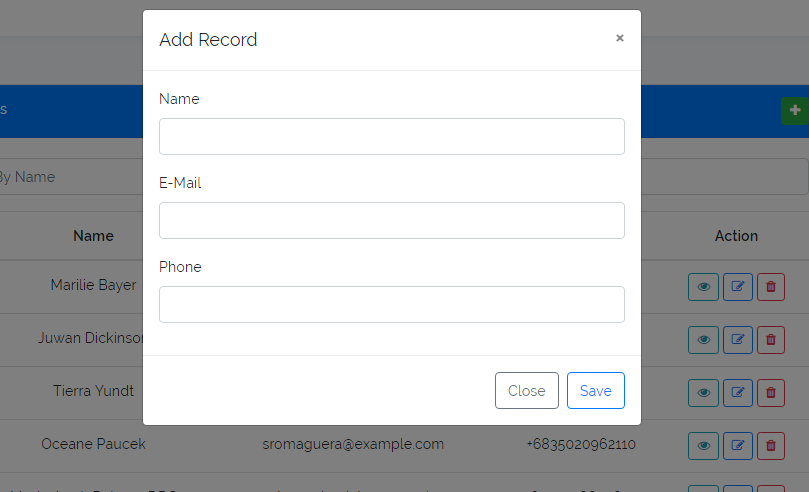
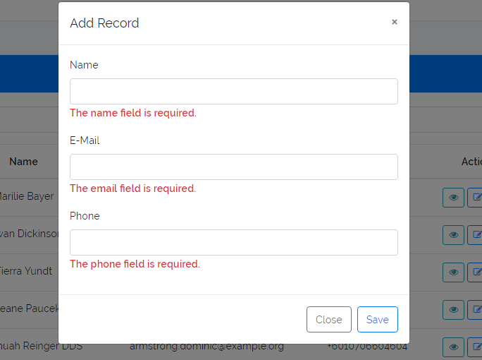
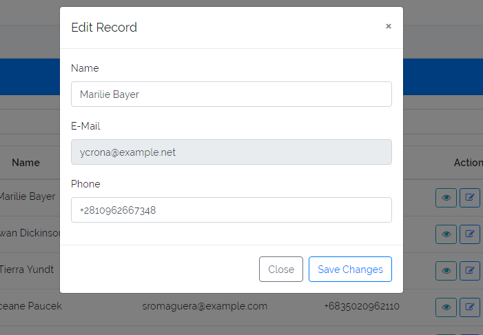
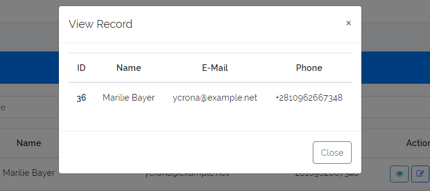

### Mini Project with Laravel & Vue js.

In this mini project you can CRUD Operation, CRUD => Create,Read,Update and Delete.

##### I hope you like it..

1. Clone this repository (or download and extract the .zip)

2. Run `composer install` from inside the project directory to download PHP dependencies.

3. Run `npm install` or `yarn` to download JS dependencies.

4. Run `cp .env.example .env` to create your projects' `.env` file.

5. Run `php artisan key:generate` to create a new encryption key.

6. Open the project and edit the `.env` file to add database settings to your project. Take note of the database name, password, and username to make sure they match your system's settings. Change any other environment settings you desire.

7. Back in the terminal, run `php artisan migrate` to migrate your database.
8. Run `php artisan db:seed` to seed your database.

Congratulations! You can now run this mini project.

#### It's home page, here you can also search record by name and also add pagination.

#### Here you can add new record.

#### Add some validation...........

##### Here you can update any record.

#### Here you can see one record.

### Sorry for my bad english..:(
