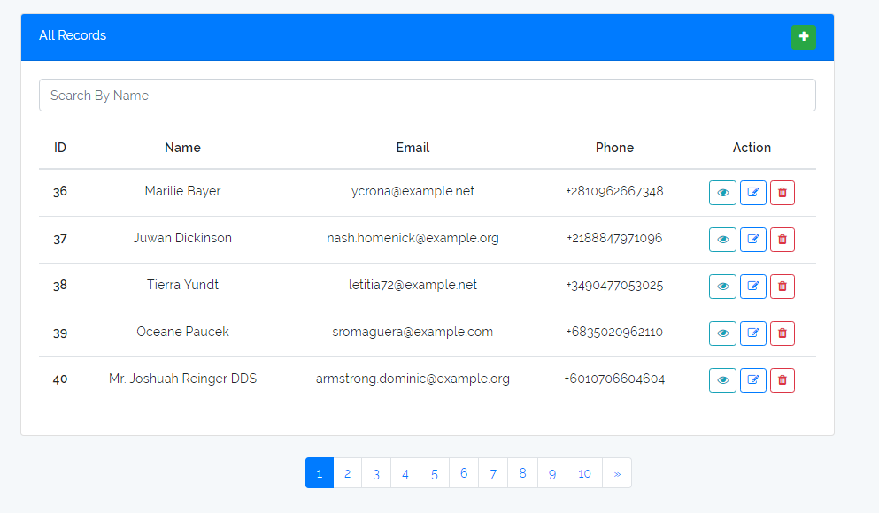

### Mini Project with Laravel & Vue js.

In this mini project you can perform CRUD Operation, CRUD => Create,Read,Update and Delete.

##### I hope you like it..

#### It's home page, here you can also search record by name and also add pagination.

##### 1. Clone this repository (or download and extract the .zip)

##### 2. Run `composer install` from inside the project directory to download PHP dependencies.

##### 3. Run `npm install` or `yarn` to download JS dependencies.

##### 4. Run `php artisan laravel-vue:install` and just give the answers.

##### Congratulations! You can now run this mini project.